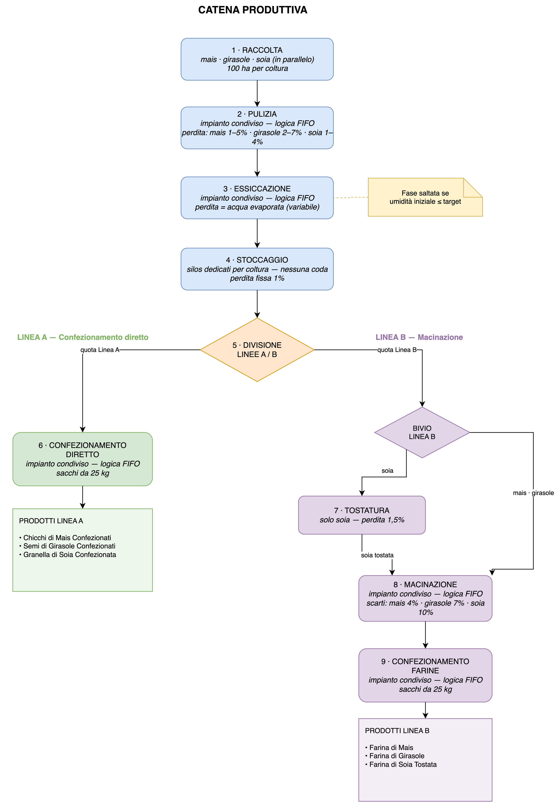

# Simulazione Agricola

Project work per il tema n. 1 "La digitalizzazione dell'impresa" — traccia n. 15: "Sviluppo di un codice Python per simulare un processo produttivo nel settore primario".

Il modello simula la catena produttiva di tre colture — **mais, girasole e soia** — su 100 ettari ciascuna: dalla raccolta al confezionamento, attraverso 9 fasi organizzate in due linee produttive (confezionamento diretto e trasformazione in farina). Cinque impianti sono condivisi tra le colture e gestiti con **code FIFO**: le attese che ne derivano permettono di individuare il collo di bottiglia del processo tramite analisi statistica su 1000 simulazioni.

## Applicazione web

Il simulatore è utilizzabile online, senza installare nulla:

**https://simulazione-agricola.streamlit.app**

Quattro modalità disponibili: simulazione singola casuale, analisi statistica su 1000 simulazioni, simulazione con parametri manuali, simulazione con seed fisso (riproducibile). Ogni modalità permette di scaricare i risultati in Excel (e, per l'analisi, i grafici in PDF).

## Diagramma della catena produttiva



## Struttura del codice

| File | Responsabilità |
|------|----------------|
| `constants.py` | Parametri del modello (fissi e variabili) |
| `sim.py` | Motore della simulazione: generazione casuale, calcolo delle fasi, code FIFO |
| `export.py` | Report Excel formattati, grafici matplotlib, export PDF |
| `ui.py` | Interfaccia web (Streamlit) |

## Esecuzione in locale

```bash
pip install -r requirements.txt
streamlit run ui.py
```
